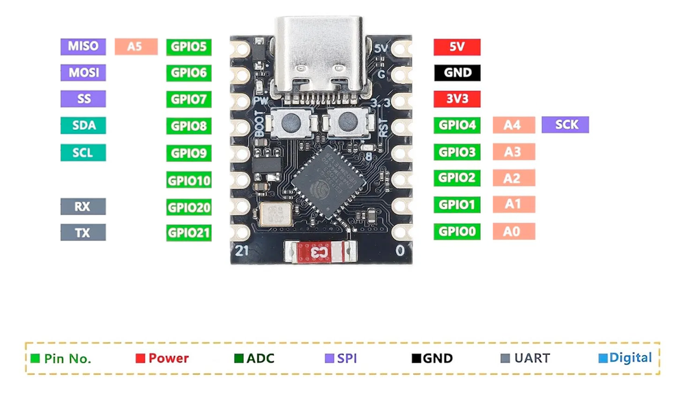
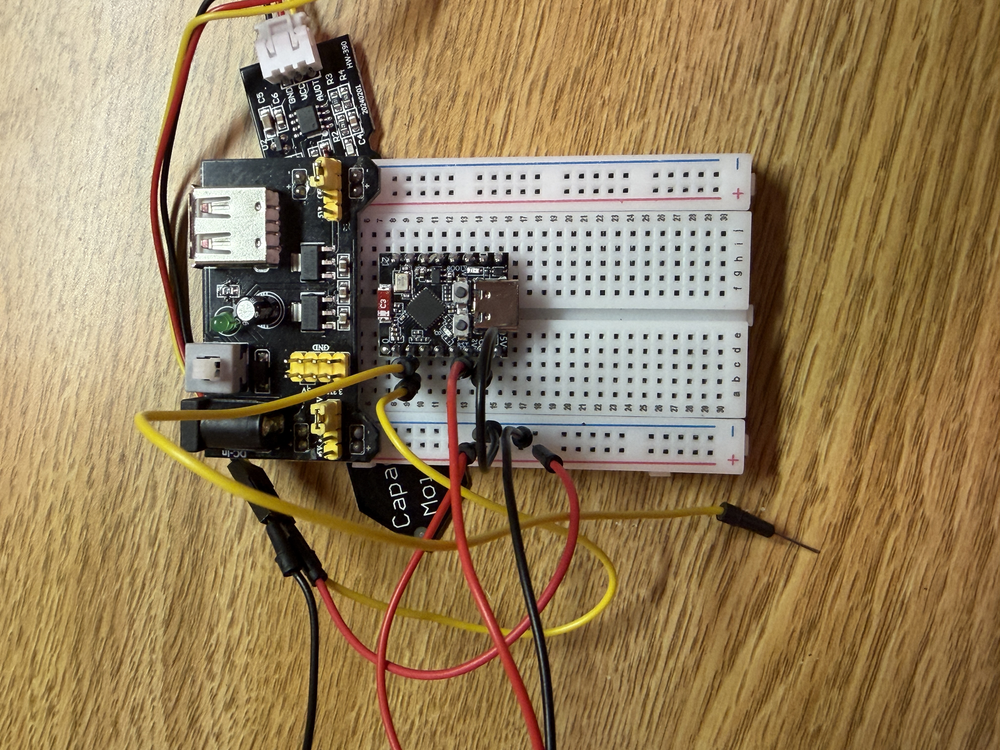

# This was a hobby project, wanted to mess with electronics
# items required
1. ESP 32(i did this with ESP32 C3 super mini)
2. mb102 power supply board
3. breadboard
4. capacitive soil moisture sensor V.2.0.0 with female ends
5. jumper wires(6 male to male)
6. barrel jack with wall adapter or a battery source
7. usb type c 
8. plants
9. patience

# installation
install arduino IDE from [arduino](https://www.arduino.cc/en/software/)

# file setup
download files into folder and open in Arduino IDE

# esp32 board support
1. open Arduino IDE, go to settings
2. click on "Additional boards manager URLs"
3. paste "https://raw.githubusercontent.com/espressif/arduino-esp32/gh-pages/package_esp32_index.json" and click ok
4. go to tools, board, boards manager
5. search esp32 and click 'esp32 by Espressif Systems'
6. go to tools, board, esp32, click on 'ESP32C3 Dev Module'
7. go to tools, port, click on smth named > /dev/cu.usbmodem... (make sure ur esp32 is connected to laptop)

# email setup
1. go to sketch, include library, manage libraries
2. search 'ESP Mail Client'
3. find 'ESP Mail Client by Mobizt' and install

# wiring (IMP)
1. get a breadboard, i used a MB102 breadboard
2. plug the mb102 power supply board at the top, its gonna cover 4 rows.
3. plug the esp 32 below with the usb type c plug facing down, starting from row 8 to row 15. 
4. plug the jumper wires for ESP32 and sensor as follows:
sensor: 
Sensor VCC  → 3.3V rail (MB102)
Sensor GND  → GND rail
Sensor AOUT → GPIO1
esp32:
ESP32 3V3   → 3.3V rail
ESP32 GND   → GND rail
ESP32 GPIO1 → leave the other loose

in dummies, google the esp32 c3 super mini pinout and follow, i like this one ( (for rail connections, it doesn't matter where u plug it, plug it anywhere):
esp 32 connections: 
1. yellow → GPI01
2. red → +ve rail to 3V3
3. black → GND to -ve rail

sensor: 
connect jumper wires color to the female exposed ends with the right color, and connect as follows (for rail connections, it doesn't matter where u plug it, plug it anywhere):
1. red → +ve rail
2. black → -ve rail
3. yellow → next to yellow esp32 wire

# next steps
1. put jumper cap on 3.3V on both sides for the power supply, too much voltage can damage our esp32!!
2. 
3. confirm the connections work by plugging in the barrel jack/power source, two lights should light up, a green one on power supply board and red on esp32.

# running the code
1. open [moisture_calibrator.ino](moisture_calibrator/moisture_calibrator.ino)
2. connect esp32 to laptop and click the right arrow at the top left to upload code
3. it should read moisture levels correcly, calibrate for air, water, dry soil, wet soil. 
4. depending on the plant, adjust moisture level in [main.ino](main.ino/main.ino) on line 25(i had succulents, so i chose a moisture level of 15 by accounting for air, water, dry soil, wet soil)
5. paste the avg of values you got while calibrating in line 21 and 22

# final thoughts
you can change the amount of times it checks moisture, i set the time interval to every 6 hours, change this on line 26.

if you connect it to ur hotspot, make sure "maximize compatibility is turned on, this makes it broadcast on 2.4GHz which the ESP32 needs. The ESP32 cannot connect to 5GHz rip"

for the power source, if you dont have a barrel jack, you could use a battery, i had a spare 18650 battery, but ends were exposed. I could still connect it directly to breadboard, but I noticed I had a wall adapter with a barrel jack :D.

you might have noticed the yellow esp32 wire with an exposed male end, you could just leave that as it is, it will connect with the sensor wire provided they are in the same row!!

# whats next?
i originally planned this to be an automatic watering system, but I needed a boost converter and a mini water pump. They would not arrive on time, so I had to settle with a friend to water them.

if you do plan to set this up, you would need a MOSFET, resistor and a motor too. To make things easier just get a L9110 motor board which includes all of them. don't forget to get a silicon tubing and TP4056 charging module to charge the 18650 via usb.

# acknowledgement
huge thanks to Mr. Terry, who provided me with all the materials for this hobby project. now my summer succulents can survive without me(still needs someone to water them :P)

